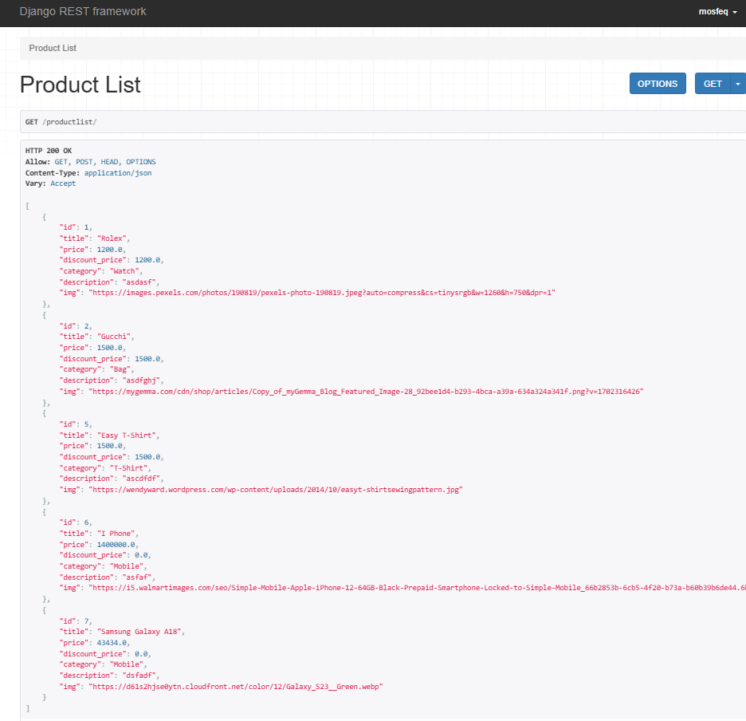
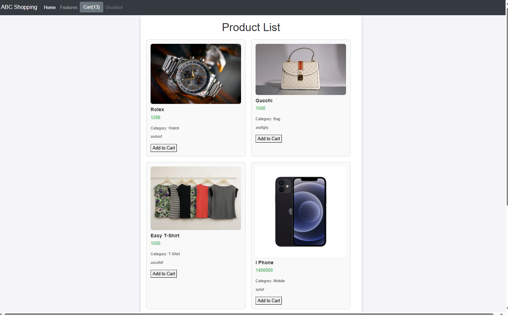
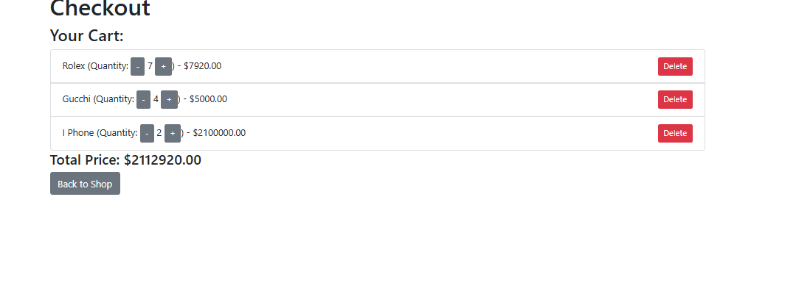

# E-Commerce Cart System with API

This project is a simple e-commerce cart system that consists of a frontend application and an API backend. It allows users to add items to their cart, update quantities, delete products, and view the total price, with all data stored in `localStorage`. Additionally, an API is provided to handle product data retrieval.

## Features

### Frontend Features:
- **Add Items to Cart**: Users can add products to their shopping cart.
- **Update Item Quantity**: Users can increase or decrease the quantity of an item in their cart.
- **Remove Items**: Users can remove specific products from the cart.
- **Persistent Cart**: Cart data is stored in `localStorage`, so it persists even after page reloads.
- **Total Price Calculation**: The total price of items in the cart is updated dynamically based on item quantities.

### API Features:
- **GET Products**: Retrieve a list of all products available in the store.
- **POST Add to Cart**: Endpoint to add products to the cart (this could be extended for user management).
- **PUT Update Cart**: Allows updating the quantity of items in the cart.
- **DELETE Remove Item**: Allows users to remove a product from the cart.

## Technologies Used

- **Frontend**:
  - **HTML**: For the structure and layout of the page.
  - **CSS**: For styling the page (via Bootstrap).
  - **JavaScript**: To handle the functionality of the cart (adding/removing items, updating quantities, calculating prices).
  - **localStorage**: To store cart data persistently.

- **Backend (API)**:
  - **Node.js/Express**: For creating the REST API.
  - **MongoDB**: To store product data (optional depending on your setup).

## Files Overview

- `index.html`: The main page where users can view and add products to their cart.
- `checkout.html`: A page that displays the cart items, allows quantity adjustment, and enables item deletion.
- `script.js`: Contains the logic for managing the cart (adding/removing items, updating quantities, and calculating the total price).
- `api/`: Directory containing the backend API implementation.

## API Documentation

### 1. **GET /api/products**
   - **Description**: Retrieves a list of products available in the store.
   - **Response**:
     ```json
     [
       {
         "id": 1,
         "title": "Product 1",
         "price": 100,
         "category": "Electronics",
         "description": "Description of product 1",
         "img": "product1.jpg"
       },
       {
         "id": 2,
         "title": "Product 2",
         "price": 200,
         "category": "Clothing",
         "description": "Description of product 2",
         "img": "product2.jpg"
       }
     ]
     ```

### 2. **POST /api/cart**
   - **Description**: Adds a product to the cart.
   - **Request Body**:
     ```json
     {
       "productId": 1,
       "quantity": 2
     }
     ```
   - **Response**:
     ```json
     {
       "message": "Product added to cart successfully"
     }
     ```

### 3. **PUT /api/cart**
   - **Description**: Updates the quantity of an item in the cart.
   - **Request Body**:
     ```json
     {
       "productId": 1,
       "quantity": 3
     }
     ```
   - **Response**:
     ```json
     {
       "message": "Cart updated successfully"
     }
     ```

### 4. **DELETE /api/cart/{productId}**
   - **Description**: Removes a product from the cart.
   - **Response**:
     ```json
     {
       "message": "Product removed from cart successfully"
     }
     ```

## Installation Instructions

## Setup Instructions

1. Clone the repository:
   ```bash
   git clone [https://github.com/your-username/your-repo-name.git](https://github.com/mosfeqahamed/simple_ecommerceApi)
   cd ecomapi
   
2.Activate virtual environment:
cd env\Scripts\activate`

3.Install dependencies:
pip install -r requirements.txt

4.Set up the database:
python manage.py migrate

5.Create a superuser to access the admin panel:
python manage.py createsuperuser

6.Run the development server:
python manage.py runserver

7.Access the application at http://127.0.0.1:8000/productlist/
8.Access frontend file and run index.html
